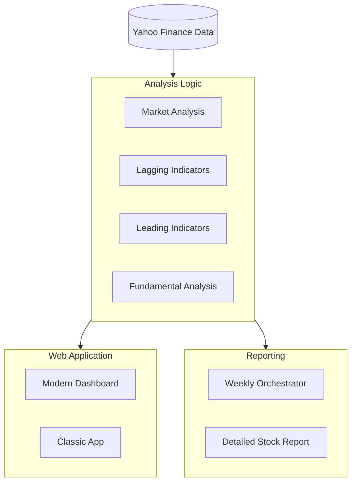

# Stock Research & Technical Analysis


A comprehensive Python-based stock technical analysis toolkit featuring multiple indicators, relative strength analysis, fundamental analysis, automated reporting, and an integrated web application for interactive visualization.

> 📱 **Quick Start**: Jump straight to the [Web Application](#-web-application) section to start analyzing stocks with an interactive UI!

## 📊 Overview

This project provides a complete suite of technical and fundamental analysis tools organized into five main components:

1.  **⚡️ Lagging Indicator Analysis** - Trend-following and momentum indicators
2.  **🔮 Leading Indicator Analysis** - Divergence-based predictive signals
3.  **🏙️ Market Analysis** - Sector analysis, batch analysis, and relative strength tools
4.  **🏢 Fundamental Analysis** - Financial health, growth trends, and valuation metrics
5.  **📑 Automated Reporting** - PDF report generation for weekly analysis and deep dives
6.  **🌐 Web Interfaces** - Two Flask-based UIs (classic and modern dashboard)

## 🏗️ System Architecture



## 🌐 Web Interfaces

**The easiest way to use this project is through one of the two web interfaces!**

### Option 1: Modern Dashboard UI (Recommended) 🌟

A sleek, modern interface with sidebar navigation and comprehensive market analysis.

👉 **[View detailed Website UI documentation](./website_ui/README.md)**

**Quick Start:**
```bash
cd website_ui
python app.py
# Navigate to http://127.0.0.1:5001
```

**Features:**
- ✅ **Modern dashboard layout**: Sidebar with stock watchlist
- ✅ **Market Analysis**: Sector analysis, stocks in sector, batch analysis
- ✅ **All indicators**: Leading and lagging indicators with RS analysis
- ✅ **Multiple timeframes**: 1d, 1wk, 1mo, 1h, 15m
- ✅ **Real-time charts**: Auto-generated visualizations
- ✅ **Support for global markets**: US stocks, NSE, BSE

### Option 2: Classic Web App

The original tabbed interface with all technical indicators.

👉 **[View detailed Web App documentation](./web_app/README.md)**

**Quick Start:**
```bash
cd web_app
python app.py
# Navigate to http://127.0.0.1:5000
```

## 📈 Technical Indicators

### Lagging Indicators (Trend-Following) 🐢

Located in `lagging_indicator_analysis/`

#### 1. MACD Analysis
- **File**: [`macd_analysis.py`](./lagging_indicator_analysis/macd_analysis.py)
- **Type**: Momentum oscillator
- **Signals**: Trend, momentum, crossovers, divergences
- **Use Case**: Identify trend strength and potential reversals

#### 2. Supertrend Analysis
- **File**: [`supertrend_analysis.py`](./lagging_indicator_analysis/supertrend_analysis.py)
- **Type**: ATR-based trend follower
- **Signals**: Uptrend/Downtrend, dynamic support/resistance
- **Use Case**: Clear trend identification with stop-loss levels

#### 3. Bollinger Bands
- **File**: [`bollinger_band_analysis.py`](./lagging_indicator_analysis/bollinger_band_analysis.py)
- **Type**: Volatility bands
- **Signals**: Overbought/Oversold, squeeze, breakouts
- **Use Case**: Mean reversion and volatility expansion trades

#### 4. EMA Crossover
- **File**: [`crossover_analysis.py`](./lagging_indicator_analysis/crossover_analysis.py)
- **Type**: Multi-timeframe moving averages
- **Signals**: Golden Cross, Death Cross, trend alignment
- **Use Case**: Long-term trend confirmation

#### 5. Donchian Channels
- **File**: [`donchian_channel_analysis.py`](./lagging_indicator_analysis/donchian_channel_analysis.py)
- **Type**: Breakout indicator (Turtle Trading)
- **Signals**: Upper/Lower channel breakouts
- **Use Case**: Breakout trading and channel-based entries

#### 6. Multi-Timeframe Analysis
- **File**: [`multi_timeframe_analysis.py`](./lagging_indicator_analysis/multi_timeframe_analysis.py)
- **Type**: Composite Trend & Momentum
- **Features**:
  - Combined Supertrend & MACD analysis across Weekly, Daily, and 15-Minute timeframes
  - Multi-pane interactive candlestick charts with EMA overlays
  - Integrated into PDF reports and Web Dashboard
- **Use Case**: Holistic trend verification across multiple time horizons

### Leading Indicators (Predictive) 🐇

Located in `leading_indicator_analysis/`

#### 1. RSI Divergence
- **File**: [`rsi_divergence_analysis.py`](./leading_indicator_analysis/rsi_divergence_analysis.py)
- **Type**: RSI-based divergence detector
- **Signals**: Bullish/Bearish divergences
- **Use Case**: Early reversal detection

#### 2. RSI-Volume Divergence
- **File**: [`rsi_volume_divergence.py`](./leading_indicator_analysis/rsi_volume_divergence.py)
- **Type**: Combined RSI and volume analysis
- **Signals**: Multi-dimensional divergences, early reversals
- **Use Case**: High-confidence reversal signals with volume confirmation

#### 3. Volatility Squeeze
- **File**: [`volatility_squeeze_analysis.py`](./leading_indicator_analysis/volatility_squeeze_analysis.py)
- **Type**: Bollinger Bands + Keltner Channels
- **Signals**: Squeeze detection, breakout anticipation
- **Use Case**: Low volatility to high volatility transitions

#### 4. Relative Strength (RS) Analysis
- **File**: [`rs_analysis.py`](./leading_indicator_analysis/rs_analysis.py)
- **Type**: Multi-timeframe momentum comparison
- **Features**:
  - RS calculation across 1M, 2M, 3M, 6M, 1Y, 3Y, 5Y
  - Momentum pattern detection
  - Early turnaround signals
  - Automated ranking system
- **Use Case**: Compare stocks within sectors, identify relative winners

#### 5. Volume Analysis
- **File**: [`volume_analysis.py`](./leading_indicator_analysis/volume_analysis.py)
- **Type**: Advanced Volume-Price Analysis
- **Features**:
  - **Climax Volume (Churning)**: Identification of stalling despite high volume
  - **Distribution Days**: Detection of institutional selling
  - **Exhaustion Signals**: Peak/Trough divergence detection (Buying/Selling Exhaustion)
  - **Visualizations**: Overlay of signals on Price/Volume chart
- **Use Case**: Identify localized tops/bottoms and smart money exits


## 🏢 Fundamental Analysis

Located in `fundamental_analysis/`

#### Core Analysis
- **File**: [`fundamental_analysis.py`](./fundamental_analysis/fundamental_analysis.py)
- **Type**: Financial health and growth analysis
- **Features**:
  - 📊 **4-Year Trends**: Revenue, Profit, ROE, EPS growth (1Y vs 3Y CAGR)
  - 📉 **6-Quarter Trends**: Quarter-over-quarter growth analysis
  - 💰 **Valuation**: PE Ratio comparison vs Industry averages
- **Use Case**: Validate technical setups with fundamental strength

## 📊 Market Analysis Tools

Located in `market_analysis/`

#### 1. Sector Analysis
- **File**: [`sector_analysis.py`](./market_analysis/sector_analysis.py)
- **Type**: Sector-wide relative strength analysis
- **Features**:
  - Analyze all stocks within a sector
  - Identify consistent leaders, emerging momentum, and turnarounds
  - Technical confirmation filters (MA breakout, volume surge)
  - Composite scoring and ranking
- **Use Case**: Find the best stocks within a sector

#### 2. Stocks in Sector Analysis
- **File**: [`stock_in_sector_analysis.py`](./market_analysis/stock_in_sector_analysis.py)
- **Type**: Individual stock analysis within sector context
- **Features**:
  - Compare individual stock to sector index
  - Relative performance metrics
- **Use Case**: Evaluate stock performance vs sector benchmark

#### 3. Batch Analysis
- **File**: [`batch_analysis.py`](./market_analysis/batch_analysis.py)
- **Type**: Multi-stock analysis engine
- **Features**:
  - Analyze multiple stocks simultaneously
  - Apply technical indicators across watchlists
  - Generate comparative reports
- **Use Case**: Screen and compare multiple stocks efficiently

## 📑 Automated Reporting

Located in `batch_reports/`

#### Weekly Analysis Orchestrator
- **File**: [`run_weekly_orchestrator.py`](./batch_reports/scripts/run_weekly_orchestrator.py)
- **Function**: End-to-end automation for weekly market review
- **Workflow**:
  1. 📂 Creates a dated folder for the current week
  2. 🔍 Runs `weekly_analysis.py` to identify top picks
  3. 📝 Generates detailed PDF reports for identified picks
  4. 📋 Generates detailed PDF reports for your batch watchlist
- **Output**: Comprehensive PDF reports saved in `batch_reports/reports/<date>/`

## 🚀 Installation

### Prerequisites
```bash
Python 3.8 or higher
```

### Install Dependencies
```bash
pip install pandas numpy yfinance matplotlib scipy flask reportlab
```

Or using requirements.txt:
```bash
pip install -r requirements.txt
```

## 💻 Usage

### Web Interfaces (Recommended)
See [Modern Dashboard UI](./website_ui/README.md) or [Classic Web App](./web_app/README.md).

### Automated Weekly Reports
Generate a full set of reports for the week:
```bash
python batch_reports/scripts/run_weekly_orchestrator.py
```

### Standalone Python Scripts

**Fundamental Analysis:**
```python
from fundamental_analysis.fundamental_analysis import analyze_revenue_growth_4y
print(analyze_revenue_growth_4y("AAPL"))
```

**Technical Analysis:**
```bash
# MACD Analysis
python lagging_indicator_analysis/macd_analysis.py

# Supertrend Analysis  
python lagging_indicator_analysis/supertrend_analysis.py

# ... (other indicators)
```

## 📁 Project Structure

```
stock_research/
├── README.md                          # This file - Project overview
├── batch_reports/                     # Automated PDF reporting
│   ├── reports/                       # Generated report output
│   └── scripts/                       # Orchestration scripts
│       ├── run_weekly_orchestrator.py # Main automation entry point
│       ├── stock_detailed_report.py   # Individual PDF generator
│       └── weekly_analysis.py         # Weekly market screening
├── fundamental_analysis/              # Fundamental health metrics
│   └── fundamental_analysis.py        # Growth & valuation logic
├── lagging_indicator_analysis/        # Trend-following indicators
│   ├── macd_analysis.py               # MACD Momentum & Trend
│   ├── supertrend_analysis.py         # Supertrend & Trend direction
│   ├── bollinger_band_analysis.py     # Volatility Bands
│   ├── crossover_analysis.py          # EMA Crossovers
│   ├── donchian_channel_analysis.py   # Price Channel Breakouts
│   ├── kalman_filter_analysis.py      # Noise reduction (Experimental)
│   └── multi_timeframe_analysis.py    # Multi-timeframe trend analysis
├── leading_indicator_analysis/        # Predictive indicators
│   ├── rs_analysis.py                 # Relative Strength analysis
│   ├── rsi_divergence_analysis.py     # RSI Divergence detection
│   ├── rsi_volume_divergence.py       # RSI + Volume Divergence
│   └── volatility_squeeze_analysis.py # Volatility Squeeze detection
├── market_analysis/                   # Market-wide analysis tools
│   ├── batch_analysis.py              # Multi-stock batch processing
│   ├── sector_analysis.py             # Sector-wide relative strength
│   └── stock_in_sector_analysis.py    # Stock vs Sector comparison
├── web_app/                           # Classic Flask web application
├── website_ui/                        # Modern dashboard web interface
├── data/
│   ├── tickers_list.json              # Stock ticker lists
│   ├── tickers_grouped.json           # Sector-grouped tickers
│   ├── tickers_batch_analysis.json    # Batch analysis configs
│   └── watchlist.json                 # User watchlist
├── docs/
├── experiments_space/                 # Experimental strategies
└── stock_analysis.py                  # Legacy analysis script
```

## ⚠️ Disclaimer

**This tool is for educational and research purposes only.**

- Not financial advice
- No guarantee of accuracy or profitability
- Past performance ≠ future results
- Always do your own research
- Consult a financial advisor before trading

## 📝 License

For personal use only.

---
Made with ❤️ for stock market enthusiasts and technical analysts

**Last Updated**: January 2026  
**Version**: 2.1
