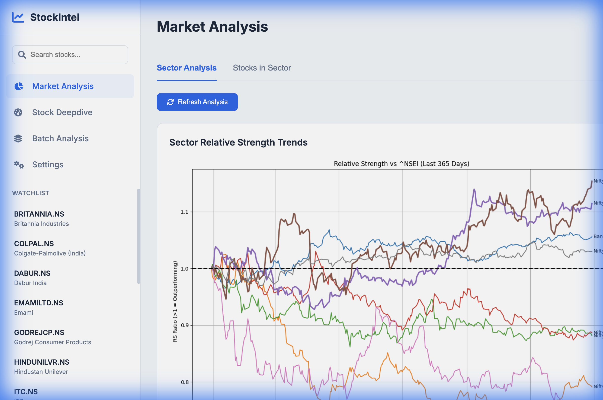
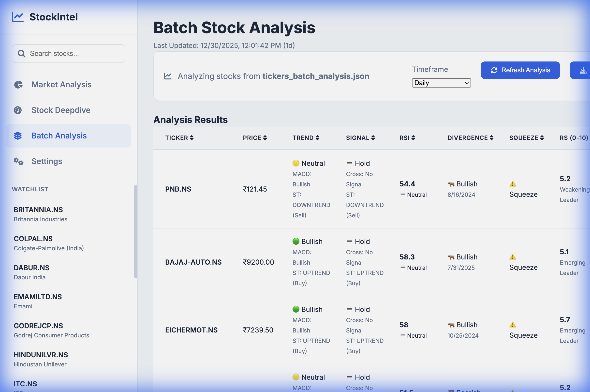
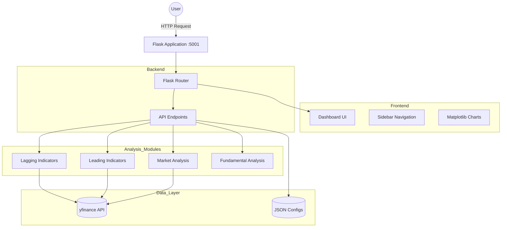

# Stock Research Platform - Modern Dashboard UI 🚀


A sleek, modern web interface for comprehensive stock technical analysis featuring a sidebar-based dashboard, market analysis tools, and all leading and lagging technical indicators.

## 🎯 Overview

This is the **modern dashboard interface** for the Stock Technical Analysis platform. It provides a contemporary user experience with sidebar navigation, stock watchlist management, and comprehensive market analysis capabilities including sector analysis and batch processing.

> 💡 **Looking for the classic tabbed interface?** Check out the [Web App](../web_app/README.md) which offers a traditional multi-tier tab layout. It runs on port 5000.

## 📸 Interface Preview

## 📸 Interface Preview

### Dashboard Overview


### Market Analysis


### Batch Analysis


## 🏗️ System Architecture



## ✨ Features

### Dashboard & Navigation
- **Modern Sidebar Layout**: Clean, responsive design with persistent navigation
- **Stock Watchlist**: Quickly switch between favorite stocks from the sidebar
- **Multi-Page Architecture**: Separate pages for Dashboard, Market Analysis, and Batch Analysis
- **Responsive Design**: Works seamlessly across different screen sizes

### Market Analysis Tools

#### 1. **Sector Analysis** 🏙️
- Analyze all stocks within a sector simultaneously
- Identify consistent leaders, emerging momentum, and potential turnarounds
- Technical confirmation filters (MA breakout, volume surge)
- Composite scoring and ranking system
- Visual RS trend charts

#### 2. **Stocks in Sector** 📊
- Compare individual stock performance to sector index
- Relative strength metrics across multiple timeframes
- Sector-specific benchmarking

#### 3. **Batch Analysis** 📑
- Analyze multiple stocks simultaneously
- Apply technical indicators across entire watchlists
- Generate comparative reports
- Efficient screening and comparison

### Technical Indicators

#### Leading Indicators (Predictive) 🔮
1. **RSI Divergence Analysis**
   - Bullish/Bearish divergence detection
   - Peak and trough pattern analysis
   - Configurable RSI periods and thresholds

2. **RSI-Volume Divergence**
   - Combined RSI and volume analysis
   - Early reversal signal detection
   - Multi-dimensional divergence identification

3. **Volatility Squeeze**
   - Bollinger Bands + Keltner Channels
   - Squeeze detection and breakout anticipation
   - Low-to-high volatility transition signals

4. **Relative Strength (RS) Analysis**
   - Multi-timeframe momentum comparison (1M, 2M, 3M, 6M, 1Y, 3Y, 5Y)
   - Momentum pattern detection
   - Early turnaround signals
   - Automated ranking system

#### Lagging Indicators (Trend-Following) 🐢
1. **MACD Analysis**
   - Momentum oscillator with divergence detection
   - Trend and crossover signals
   - Configurable fast, slow, and signal periods

2. **Supertrend Analysis**
   - ATR-based trend identification
   - Dynamic support/resistance levels
   - Clear uptrend/downtrend signals

3. **Bollinger Bands**
   - Volatility-based bands
   - Overbought/Oversold detection
   - Squeeze and breakout signals

4. **EMA Crossover**
   - Multi-timeframe moving averages
   - Golden Cross/Death Cross detection
   - Trend alignment confirmation

5. **Donchian Channels**
   - Breakout indicator (Turtle Trading)
   - Upper/Lower channel breakouts
   - Channel-based entry signals

### User Interface Features
- **Real-time Chart Generation**: Auto-generated matplotlib visualizations
- **Configurable Parameters**: Customize each indicator's settings
- **Multiple Timeframes**: Support for 1d, 1wk, 1mo, 1h, 15m intervals
- **Global Market Support**: US stocks, NSE (India), BSE (India)
- **Interactive Results**: Detailed metrics, signals, and visual charts

## 📋 Prerequisites

- **Python**: 3.8 or higher
- **Dependencies**:
  - Flask
  - matplotlib
  - pandas
  - numpy
  - yfinance
  - scipy

## 🚀 Installation

1. **Navigate to the website_ui directory**:
   ```bash
   cd /Users/solankianshul/Documents/projects/stock_research/website_ui
   ```

2. **Install required packages** (if not already installed):
   ```bash
   pip install flask matplotlib pandas numpy yfinance scipy
   ```

## 🎮 Running the Application

1. **Start the Flask server**:
   ```bash
   python app.py
   ```

2. **Open your web browser** and navigate to:
   ```
   http://127.0.0.1:5001
   ```

3. **Select a stock from the watchlist** or enter a ticker symbol to begin analysis

## 🌍 Ticker Format

- **US Stocks**: Use standard ticker symbols
  - Examples: `AAPL`, `MSFT`, `TSLA`, `GOOGL`
  
- **Indian Stocks (NSE)**: Add `.NS` suffix
  - Examples: `RELIANCE.NS`, `TCS.NS`, `INFY.NS`
  
- **Indian Stocks (BSE)**: Add `.BO` suffix
  - Examples: `RELIANCE.BO`, `TATAMOTORS.BO`

## 🏗️ Architecture

### Backend (`app.py`)
- **Framework**: Flask web server
- **Port**: 5001 (localhost)
- **Key Endpoints**:
  - `/` - Main dashboard page
  - `/market-analysis` - Market analysis page
  - `/batch-analysis` - Batch analysis page
  - `/api/analyze` - Stock analysis API (POST)
  - `/api/sector-analysis` - Sector analysis API (POST)
  - `/api/stocks-in-sector` - Stocks in sector API (POST)
  - `/api/batch-analysis` - Batch analysis API (POST)
  - `/api/tickers` - Get ticker lists (GET)
  - `/api/watchlist` - Get watchlist stocks (GET)
  - `/api/benchmarks` - Get benchmark indices (GET)
  - `/api/sectors` - Get available sectors (GET)

### Frontend Structure

#### Templates (`templates/`)
- **base.html**: Base layout with sidebar navigation
- **dashboard.html**: Main stock analysis dashboard
- **market_analysis.html**: Market analysis page with sector tools
- **batch_analysis.html**: Batch analysis interface
- **partials/**: Reusable analysis panel components
  - Individual indicator panels (MACD, Supertrend, Bollinger, etc.)
  - Modular design for easy maintenance

#### Static Assets (`static/`)
- **style.css**: Modern styling with responsive design
- **script.js**: Dashboard logic and API interactions

### Analysis Modules

Located in parent directory:
- `lagging_indicator_analysis/` - 5 trend-following indicators
- `leading_indicator_analysis/` - 4 predictive indicators
- `market_analysis/` - 3 market-wide analysis tools

Each module exports a `run_analysis(ticker, config)` function.

### Data Files

Located in `../data/`:
- **tickers_list.json**: Basic stock ticker lists
- **tickers_grouped.json**: Sector-grouped tickers with index symbols
- **tickers_batch_analysis.json**: Batch analysis configurations
- **watchlist.json**: User's watchlist stocks

## 🔌 API Reference

*(See previous documentation for API details)*

## ⚙️ Configuration

### Data File Setup

1. **tickers_grouped.json** - Sector-based stock organization:
```json
{
  "IT": {
    "index_symbol": "^CNXIT",
    "stocks": {
      "TCS": "TCS.NS",
      "Infosys": "INFY.NS"
    }
  }
}
```

2. **watchlist.json** - User's favorite stocks:
```json
{
  "watchlist": ["AAPL", "MSFT", "RELIANCE.NS", "TCS.NS"]
}
```

3. **tickers_batch_analysis.json** - Batch analysis configurations:
```json
{
  "watchlist": {
    "tickers": ["AAPL", "MSFT", "GOOGL"],
    "indicators": ["macd", "supertrend", "rsi"]
  }
}
```

### Indicator Configuration

All indicators support customizable parameters through the UI or API. Common parameters:
- **INTERVAL**: Data granularity (`1d`, `1wk`, `1mo`, `1h`, `15m`)
- **LOOKBACK_PERIODS**: Number of days/periods to fetch
  - **Note**: 15-minute interval limited to 59 days due to Yahoo Finance restrictions

## 🛠️ Troubleshooting

### Port Already in Use
If port 5001 is occupied:
```python
# Modify app.py line 724
app.run(debug=True, host='127.0.0.1', port=5002)  # Change port
```

### Module Not Found Errors
Ensure parent directory is in Python path:
```bash
export PYTHONPATH="${PYTHONPATH}:/Users/solankianshul/Documents/projects/stock_research"
```

 Or add at the top of `app.py`:
```python
import sys
sys.path.insert(0, '/Users/solankianshul/Documents/projects/stock_research')
```

### Data File Errors
- Ensure `tickers_grouped.json`, `watchlist.json`, and `tickers_batch_analysis.json` exist in `../data/`
- Verify JSON syntax is valid
- Check that ticker symbols are correctly formatted

### Data Fetching Errors
- Verify internet connection
- Check ticker symbol validity
- Confirm ticker exists in Yahoo Finance
- For Indian stocks, ensure correct suffix (`.NS` or `.BO`)
- **Note**: 15-minute interval data is limited to 59 days of history

### Chart Not Displaying
- Check browser console for errors
- Verify `matplotlib.use('Agg')` is set in `app.py`
- Ensure base64 image encoding is working

## 🎯 Usage Examples

### Basic Stock Analysis
1. Select a stock from the watchlist sidebar or enter a ticker
2. Click "Analyze" to run all indicators
3. View results organized by leading and lagging indicators
4. Examine charts, metrics, and signals

### Sector Analysis
1. Navigate to "Market Analysis" page
2. Select "Sector Analysis" tab
3. Choose a sector from the dropdown
4. Click "Run Analysis"
5. Review RS table with leaders, emerging stocks, and turnarounds
6. Examine RS trend chart

### Batch Analysis
1. Navigate to "Batch Analysis" page
2. Select a batch configuration
3. Click "Run Batch Analysis"
4. Review comparative results across all stocks

## 📊 Best Practices

1. **Start with Market Analysis**: Use sector analysis to identify strong sectors
2. **Select Top Stocks**: Choose stocks with high RS scores and positive momentum
3. **Confirm with Leading Indicators**: Check for RSI divergences and volatility squeezes
4. **Validate with Lagging Indicators**: Ensure trend alignment with MACD, Supertrend, and crossovers
5. **Use Multiple Timeframes**: Daily for swing trades, 15m/1h for day trades
6. **Monitor Batch Analysis**: Regularly screen your watchlist for opportunities

## 🔄 Differences from Classic Web App

| Feature | Modern Dashboard (website_ui) | Classic Web App (web_app) |
|---------|-------------------------------|---------------------------|
| **Port** | 5001 | 5000 |
| **Layout** | Sidebar with pages | Tabbed interface |
| **Market Analysis** | ✅ Full suite | ❌ Not available |
| **Batch Analysis** | ✅ Included | ❌ Not available |
| **RS Analysis** | ✅ Integrated | ❌ Not available |
| **Watchlist** | ✅ Sidebar | ❌ Not available |
| **Navigation** | Multi-page | Single-page tabs |
| **Design** | Modern, sleek | Classic, functional |

## 🚧 Future Enhancements

- Real-time data updates and live charts
- Custom strategy builder
- Backtesting framework integration
- Portfolio tracking and management
- Alert and notification system
- Export reports as PDF
- Mobile-responsive improvements
- Dark mode toggle
- User authentication and saved preferences

## 📄 License

For personal use only.

## ⚠️ Disclaimer

This tool is for educational and research purposes only. Technical analysis does not guarantee future results. Always conduct your own due diligence and consult with a financial advisor before making investment decisions.

---

**Last Updated**: December 2024  
**Version**: 1.0

**Made with ❤️ for modern stock market analysis**
